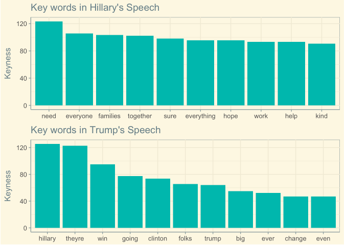
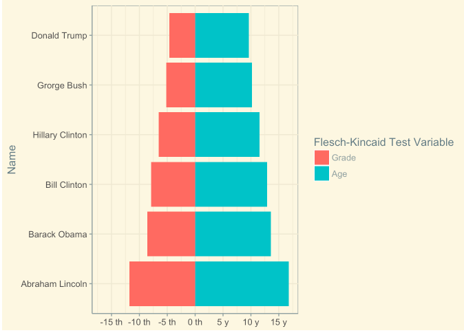
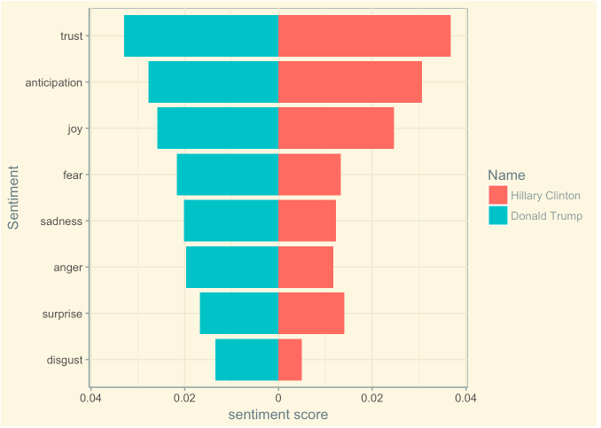
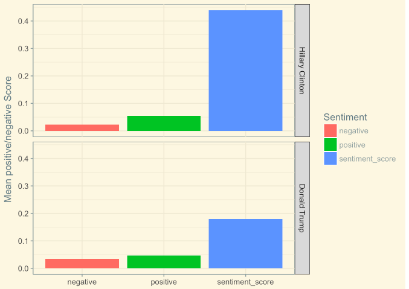

# How did Donald Trump win the presidency?
We all know that Donald Trump is the current president of the United States, in office since January 20, 2017. We also know that he has gone through a very tough campaign against with Hillary Clinton.

So, one question keep coming to my mind: How did Donald Trump win this presidency?

Not to talk about the specific political dissidence between Trump and Hillary, let me start to find the answers through analyzing their speeches.


### Project Description

#### Part One: Word Analysis
In this project, I use twenty speeches’ transcripts as my datasets, ten from Donald Trump and ten from Hillary Clinton. I will first focus on identifying the word usage differences between them. Basically, there are three sub-analysis in this part:

* Frequency Analysis <br>

* Keyness Analysis<br>

* Readability Analysis


#### Part Two : Sentence Analysis - Sentiment Analysis
After having analyzed the word similarities and differences between their speeches, I then start to perform sentence analysis. Here I will use sentences as units to perform sentiment analysis.

For each extracted sentence, I apply two sentiment analysis methods:

* NRC Sentiment Lexion.

* syuzhet Sentiment Score.


### Conclusion
Through using the simplest words, Donald Trump makes every civilian feel more close to him. He tried his best to fight with Hillary Clinton, and his speech contains lots of anger and fear, not all about anticipation and joy. Maybe this whole bunch of speaking behaviors make people feel him more like a common normal person rather than a glib politician.


Following [suggestions](http://nicercode.github.io/blog/2013-04-05-projects/) by [RICH FITZJOHN](http://nicercode.github.io/about/#Team) (@richfitz). This folder is orgarnized as follows.


```
proj/
├── lib/
├── data/
├── doc/
├── figs/
└── output/
```

Please see each subfolder for a README file.
